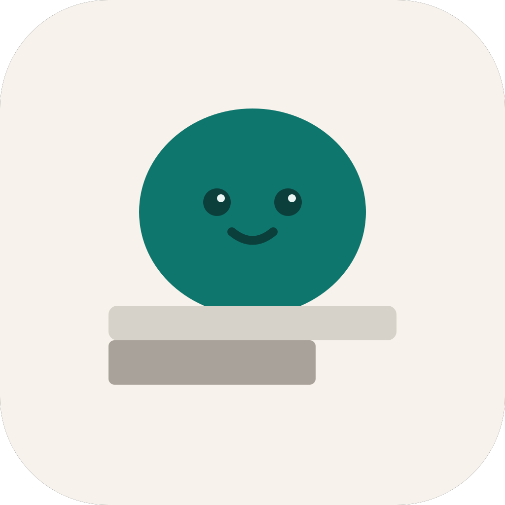

# DeskPet

透明置顶的桌面宠物，支持 **macOS** 与 **Windows**。默认自带「线条小狗」表情包，也可在设置里换自己的 GIF/PNG。



## 下载

无需克隆仓库或自己打包，直接到 **Releases** 页下载：

**[➡️ GitHub Releases](https://github.com/linxiaowang/desk-pet/releases)**

| 平台 | 文件 | 说明 |
|------|------|------|
| macOS | `DeskPet-Mac-x.x.x.dmg` | 打开 DMG，把应用拖入「应用程序」 |
| Windows | `DeskPet-Windows-x.x.x.exe` | 便携版，双击运行（无需安装） |

> 安装包**未做代码签名**。macOS 可能提示「无法验证开发者」；Windows 可能触发 SmartScreen，需选择仍要打开。仅建议自用或信任来源的测试。

## 使用

1. 启动后，宠物浮在桌面最上层，可拖动、点击切换动作。  
2. **右键宠物** → **设置…**：换宠物、为各状态选图、调整大小。  
3. **右键** → **选择宠物**：快速切换已保存的宠物。  
4. **右键** → **退出**：关闭应用。

### 自定义宠物（无需 JSON）

1. 打开 **设置…** → **新建**。  
2. 为 **待机 / 悬停 / 点击 / 拖拽** 分别 **选图**（至少要有待机）。  
3. **保存** 后即可在列表中使用。

内置「线条小狗」不可改图，可复制思路后 **新建** 自己的宠物。

## 从源码运行（开发者）

需要 Node.js 20+ 与 [pnpm](https://pnpm.io/)。

```bash
pnpm install
pnpm dev          # 开发
pnpm dist         # 本机打包（Mac 出 dmg，Windows 出 exe）
pnpm dist:win     # 在 Mac 上交叉打 Windows x64 包
```

## 发布新版本（维护者）

打 tag 后 GitHub Actions 会自动构建并上传 Release 资源：

```bash
git tag v1.0.1
git push origin v1.0.1
```

工作流定义见 [`.github/workflows/release.yml`](./.github/workflows/release.yml)。

## 技术栈

Electron · Vue 3 · TypeScript · electron-vite · UnoCSS

## License

ISC
